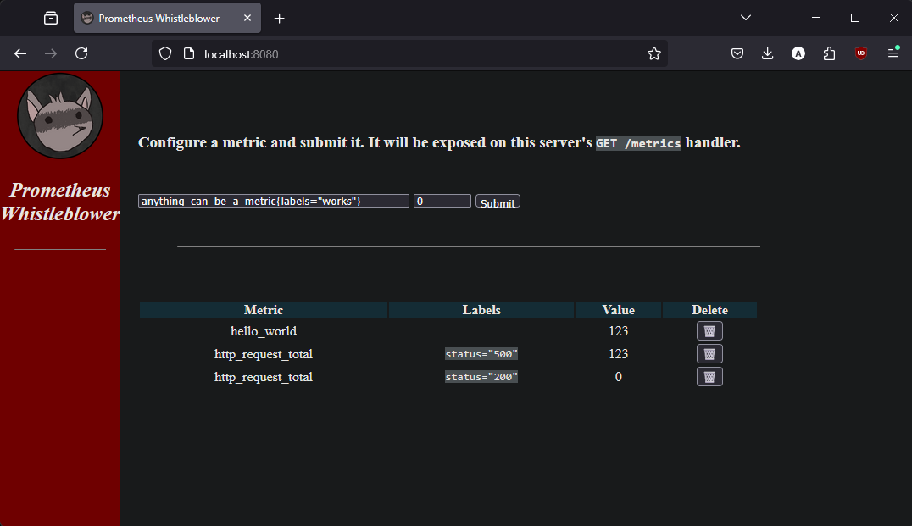

# prometheus-whistleblower

A standalone metrics exporter for Prometheus

This project is a Golang HTTP server that provides a Web interface and an API to quickly expose user-generated metrics and labels.
These metrics can then be scraped by a Prometheus server and turned into alerts to test alerting integrations
with external services.

## Usage

Build the CLI, start the server

```
$ go build .
$ ./prometheus-whistleblower -h
NAME:
   run - Run the Prometheus-whistleblower server

USAGE:
   run [global options]

GLOBAL OPTIONS:
   --port int  Port to serve the application to (default: 8080)
   --help, -h  show help
```

## Production

A Dockerfile is available in this repository and has been published to ghcr.io:

```bash
$ docker pull ghcr.io/chazapp/prometheus-whistleblower
```

An Helm chart is also available for deployment on Kubernetes.

```bash
$ helm install prometheus-whistleblower oci://ghcr.io/chazapp/helm-charts/prometheus-whistleblower
```

The Chart can configure a `kind: ServiceMonitor` for integration with Prometheus-Operator and allow the service to be scraped by your Kubernetes Prometheus instances. It can optionally template a `kind: PrometheusRule` which deploys a single alerting rule:

```yaml
rules:
  - alert: WhistleblowerAlerts
    expr: '{service="prometheus-whistleblower"}'
    annotations:
      summary: "Whistleblower raising an alert"
      description: "The whistleblower service is exposing metrics."
```

This will create an alert for any metric exposed by the service, allowing you to test alert routing and other behaviors
depending on metric name or label values. 

## Design

The project is a simple Go-Gin HTTP server implementing `prometheus-client` Collector interface.  
`POST /metric + {"metric": "some_metric", labels: [{label: "foo", value: "bar"}], "value": 123}` -> Creates and exposes a metric  
`GET /metrics` -> Returns exposed metrics in Prometheus format  
`GET /metrics/json` -> Returns exposed metrics in JSON  
`DELETE /metric/:id` -> Removes a metric stop being exposing it on the `/metrics` endpoint.  

The Go-Gin server serves a very simple HTML/CSS/JS UI accessible via browser on `GET /` which allows interactions with the server easily.

Created metrics are living in-memory and are not persistent accross restarts.

## Screenshots


